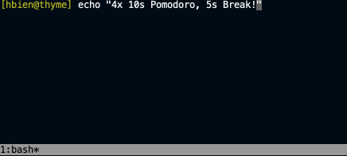

# Thyme

Thyme is a pomodoro timer for tmux.



## Installation

**Mac**

```
brew install hughbien/tap/thyme
```

This will install Crystal 1.0.0 as a dependency. If you already have this version of Crystal
installed (not via Homebrew), you can run:

```
brew install hughbien/tap/thyme --without-crystal
```

If Crystal/Shard cannot be found on your system, it may be because it's shimmed or cannot be found
by Homebrew. You'll need to pass in additional options:

```
# if you installed Crystal via Asdf
HOMEBREW_BIN=$(asdf which crystal)/../../embedded/bin HOMEBREW_CRYSTAL_PATH=`crystal env CRYSTAL_PATH` brew install hughbien/tap/thyme --without-crystal

# if you have a custom install
HOMEBREW_BIN=$(which crystal)/.. brew install hughbien/tap/thyme --without-crystal
```

**Linux**

Download the latest binary and place it in your `$PATH`:

```
wget -O thyme https://github.com/hughbien/thyme/releases/download/v0.1.4/thyme-linux-amd64
```

MD5 checksum is: `221d80b1fb7ec32ac58ca193852d9afb`

**From Source**

Checkout this repo, run `make` and `make install`:

```
git clone https://github.com/hughbien/thyme.git
cd thyme
make
make install
```

## Usage

Start thyme with:

```
thyme
```

You'll have 25 minutes by default. Other useful commands:

```
thyme       # run again to pause/unpause
thyme -s    # to stop
thyme -r    # repeats timer until manually stopped; default break of 5 minutes
thyme -r10  # repeat timer 10 times
thyme -f    # run in foreground, useful for debugging hooks
```

## Configuration

Configure via the `~/.thymerc` file:

```yaml
timer: 1500               # 25 minutes per pomodoro (in seconds)
timer_break: 300          # 5 minutes per break (in seconds)
timer_warning: 300        # show warning color at 5 minutes left (in seconds)
repeat: 4                 # set default for -r flag, otherwise repeat indefinitely
color_default: "default"  # set default timer color for tmux
color_warning: "red"      # set warning color for tmux, set to "default" to disable
color_break: "default"    # set break color for tmux
status_align: "left"      # use tmux's left status line instead, defaults to "right"
```

Thyme sets tmux's status-right/left and interval for you. If you'd prefer to do this yourself (or
need to combine it with other statuses), set `status_override`:

```yaml
status_override: false    # don't let thyme set tmux's status-right/left/interval
```

Then in your `~/.tmux.conf` file, set the status command and interval:

```
set -g status-right '#(cat /path/to/thyme-status)'
set -g status-interval 1
```

Custom options can be added via the `options` group. The today example below adds a `-t` option
for opening a todo today file. The hello example echos to STDOUT.

```yaml
options:
  today:
    flag: "-t"
    flag_long: "--today"
    description: "Open TODO today file"
    command: "vim ~/path/to/todo.md"

  hello:
    flag: "-H"
    flag_long: "--hello name"
    description: "Say hello!"
    command: "echo \"Hello #{flag}! #{args}.\"" # eg `thyme -H John "How are you?"`
```

The following placeholders are available for options:

* `#{flag}` - the argument passed to your flag
* `#{args}` - any additional arguments passed to the thyme binary

Custom hooks can be added via the `hooks` group. Valid events are: `before`/`after` a pomodoro,
`before_break`/`after_break` for breaks, and `before_all`/`after_all` for the entire session.

```yaml
hooks:
  notify:
    events: ["after"]
    command: "terminal-notifier -message \"Pomodoro finished #{repeat_suffix}\" -title \"thyme\""

  notify_break:
    events: ["after_break"]
    command: "terminal-notifier -message \"Break finished #{repeat_suffix}\" -title \"thyme\""
```

The following placeholders are available for hooks:

* `#{repeat_index}` - current repeat index
* `#{repeat_total}` - total repeat count for this session
* `#{repeat_suffix}` - if repeating is on, will return `(index/total)` eg `(3/5)`. Otherwise empty string.

## Development

Use `make` for common tasks:

```
make build                   # to create a release binary in the bin directory
make build-static            # to create a static release binary for Linux
make install                 # to copy release binary into system bin (uses $INSTALL_BIN)
make spec                    # to run all tests
make spec ARGS=path/to/spec  # to run a single test
make clean                   # to remove build artifacts and bin directory
make reset                   # to reload ~/.tmux.conf file (useful while debugging)
make run                     # to run locally
make run ARGS=-h             # to run with local arguments
```

## TODO

* optimize timer IO: only write start time (+ pauses), client side calculation, socket/fs/signal
* at exit clean up thyme PID/TMUX file

## License

Copyright 2021 Hugh Bien.

Released under BSD License, see LICENSE for details.
